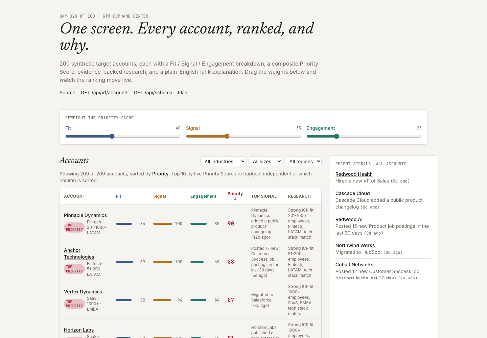
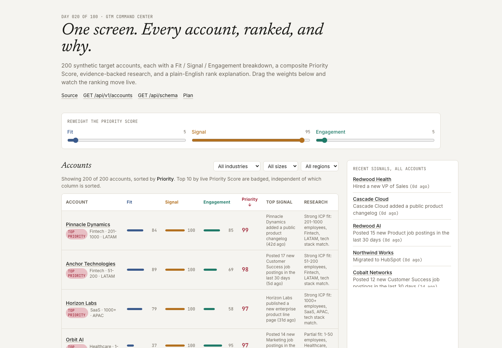
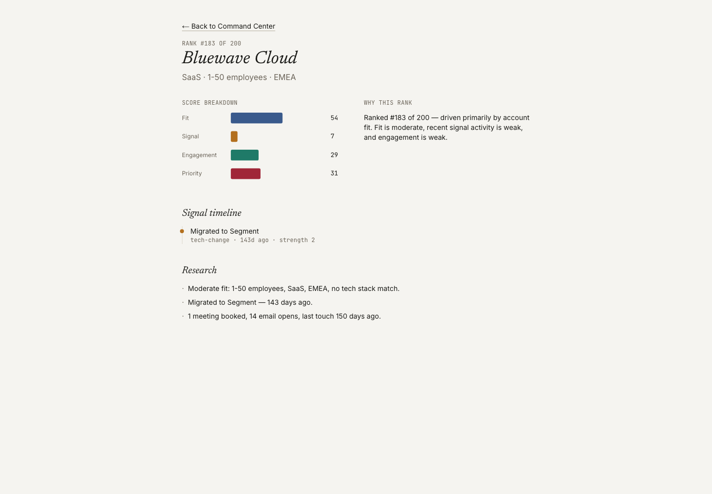

# GTM Command Center

A unified dashboard over 200 synthetic target accounts — fit, recent buying
signals, a visible three-factor score breakdown, evidence-backed research, and a
live-reweightable priority ranking, all on one screen.

**[Live demo](https://gtm-command-center-akshat-tiwarix.vercel.app)** ·
[Plain-English guide](docs/plain-english-guide.md) ·
[`GET /api/v1/accounts`](https://gtm-command-center-akshat-tiwarix.vercel.app/api/v1/accounts) ·
[Plan](./PLAN.md) · Day 020 of a 100-day building challenge



Opens on 200 synthetic accounts, each already scored on Fit, Signal, and
Engagement, and ranked by a composite Priority Score. No upload, no sign-up, no
key.

> The corpus is synthetic, seeded, and committed. Each account's firmographics,
> signals (funding, hiring surges, leadership changes, tech migrations, website
> changes), and engagement stats come from a documented generator with
> independently-derived RNG streams. There are **zero model calls** anywhere in
> this repo — every score, research bullet, and rank explanation is a
> deterministic formula, and `npm run sweep` checks nine invariants in under a
> second.

## Why I Built This

GTM teams don't lack data about their target accounts — they lack one place that
holds all of it in a shape a rep can act on. Three failures show up over and over:

**Fit and timing live in different tools, so nobody sees both at once.** A
static ICP/fit score tells you a company is a good match; a signal feed tells
you something changed recently. See only one and you either work well-matched
accounts with zero urgency behind them, or chase anything that moved regardless
of fit.

**Prioritization is usually a black box.** "This account is ranked #4" means
nothing if nobody can see what put it there.

**When leadership wants to change what "priority" means, there's no lever.** A
promo push that should favor buying signals over long-term fit requires someone
to manually re-score a spreadsheet.

This repo's subject is those three failures: one screen that holds fit, recent
signals, a visible score breakdown, evidence-backed research, and a
reweightable priority ranking — together, live, and explainable.

## What It Does

**Three sub-scores per account, each independently visible:**

| score | what it measures | formula |
|---|---|---|
| **Fit** | static firmographic ICP match | weighted industry + size + region + tech-stack match |
| **Signal** | recent buying-signal activity | recency-decayed, strength-weighted sum of that account's signals |
| **Engagement** | outreach warmth | email opens + meetings booked + last-touch freshness |

**Priority Score** is a weighted composite of the three (default weights
`0.4 / 0.35 / 0.25`) — and three sliders on the home screen let you drag those
weights and watch every account's Priority Score and the table's sort order
recompute live, client-side, reusing the exact same function the server used to
build the default-weight view.

**Two screens:** the Command Center home (sortable/filterable account table,
default-sorted by Priority Score with the top 10 badged "Top Priority", a
cross-account recent-signals feed) and an account detail page (signal timeline,
an SVG score-breakdown chart, evidence-style research bullets, and a
plain-English "why this rank" explanation).

**Zero dependency exceptions.** The score-breakdown chart is hand-rolled SVG. No
charting library.

## Demo

### Reweighting live

| Default weights (`0.4 / 0.35 / 0.25`) | Signal-heavy weights (`5 / 95 / 5`) |
|---|---|
|  |  |

Same 200 accounts, same sub-scores — only the weights moved. Orbit AI (Fit 37,
Signal 100) jumps into the top 10 the moment Signal dominates; it wasn't there
at default weights.

### Account detail



Every research bullet traces to a real field on the account — a signal it
actually has, or its own firmographic/engagement data. The "why this rank"
sentence names whichever sub-score contributes the most to the account's
current Priority Score.

## How It Works

```
data/               corpus generation (accounts + signals, seeded RNG) + committed JSON
  ↓
lib/domain/         Account, Signal, ScoreBreakdown, Weights, ResearchBullet — types + zod
  ↓
lib/scoring/        fitScore, signalScore, engagementScore, priorityScore(breakdown, weights)
  ↓
lib/research/       research bullet derivation + explainRank
  ↓
lib/command-center/ orchestration — assembles CommandCenterResult
  ↓
app/                two screens + /api/v1/accounts + /api/schema
```

1. `data/generate.ts` builds 200 synthetic accounts from a fixed seed, each with
   0–8 signals (funding, hiring surges, leadership changes, tech migrations,
   website changes), templated descriptions, and synthetic engagement stats.
2. `lib/scoring` computes Fit, Signal, and Engagement independently — none of the
   three ever changes when the weight sliders move. `priorityScore` is the only
   function that reads the weights.
3. `lib/research` derives research bullets and a rank explanation purely from an
   account's own data — no free text, no model call.
4. `lib/command-center` runs the whole pipeline once per request, ranks every
   account, and builds the cross-account signal feed.
5. The API and the home screen read the same precomputed result; the weight
   sliders are the only place anything recomputes again, and they reuse the
   exact same pure function client-side.

## Architecture

Six downward-only dependency layers (see the diagram above). `lib/scoring/` and
`lib/research/` are pure and deterministic — same corpus + same weights in,
byte-identical output out, checked by sweep invariants 5 and 9. Nothing below
`app/` imports React, HTTP, or DOM APIs, so `priorityScore` runs identically in
the browser and on the server.

## Key Decisions & Tradeoffs

- **Decision:** `SignalScore` is capped per-account (`min(rawSum / 6, 1)`)
  rather than min-max normalized across the corpus.
  **Why:** one account's score should never silently depend on what other
  accounts happen to contain.
  **Tradeoff:** the cap constant (6) is a judgment call — a corpus with
  systematically stronger signal activity would compress more accounts toward
  100 than a min-max approach would.

- **Decision:** Research bullets and rank explanations are deterministic
  templates, not model-generated text.
  **Why:** matches the rest of the series (zero model calls through Phase 1) and
  keeps every claim traceable to a real field — verifiable, not just plausible.
  **Tradeoff:** the prose is more mechanical than a real research analyst's
  notes would read.

- **Decision:** No save/share step for a custom weight configuration.
  **Why:** the whole point is a live lens over a fixed corpus, in a one-day
  build, not a configuration-management tool.
  **Tradeoff:** reweighting resets on reload. That's the first thing in *What
  I'd Build Next*.

## Getting Started

### Prerequisites

Node.js 20+, npm.

### Installation

```bash
git clone https://github.com/akshatiwarix/gtm-command-center.git
cd gtm-command-center
npm install
```

### Configuration

None. No environment variables, no API keys — the corpus is committed and every
computation is local.

### Run Locally

```bash
npm run dev
```

Open `http://localhost:3000`.

## Usage

```bash
curl https://gtm-command-center-akshat-tiwarix.vercel.app/api/v1/accounts | jq '.accounts[0] | {name: .account.name, rank, priorityScore, scores}'
```

```bash
curl https://gtm-command-center-akshat-tiwarix.vercel.app/api/schema | jq
```

## Validation / Testing

```bash
npm test          # vitest — 49 tests: domain schemas, corpus structure, each
                   # scoring formula, research-bullet traceability, explainRank's
                   # tie-break order, full-pipeline determinism
npm run typecheck  # next typegen && tsc --noEmit
npm run lint       # eslint, flat config
npm run sweep      # scripts/sweep.mts — nine invariants over the committed corpus
```

`npm run sweep` output on the committed corpus:

```
  ok  1. corpus size
  ok  2. signal volume + daysAgo range
  ok  3. sub-score bounds [0,100]
  ok  4. priority bounds under any weights
  ok  5. weights never mutate sub-scores
  ok  6. fit realism (top-fit industries score higher)
  ok  7. default-weight rank consistency + top-10 badging
  ok  8. global feed = top 20 most-recent signals corpus-wide
  ok  9. determinism (corpus generation + full pipeline, byte-identical across two runs)
```

Manually verified in-browser on the live deployment: dragging each weight
slider reorders the table, column sort works independently of the "Top
Priority" badge, industry/size/region filters narrow the row count, a
zero-signal account renders a clean empty-timeline state, and an unknown
account id renders a proper 404.

## Limitations

- Synthetic corpus — no real accounts, no live API calls, no model calls.
- Research bullets and rank explanations are templated, not analyst-written or
  model-generated.
- No save/share for a custom weight configuration; reweighting is session-only.
- No per-account API route — the detail page reads the same single
  `/api/v1/accounts` payload as the home screen.

## What I'd Build Next

- Save/share a custom weight configuration via a URL param.
- CSV export of the ranked table.
- A "why not" mode comparing two accounts' sub-scores side by side.
- Historical trend of an account's Priority Score over time (needs a
  time-series corpus, not a single snapshot).
- Swap the synthetic corpus for a real, anonymized CRM export.

## License

MIT — see [LICENSE](./LICENSE).
